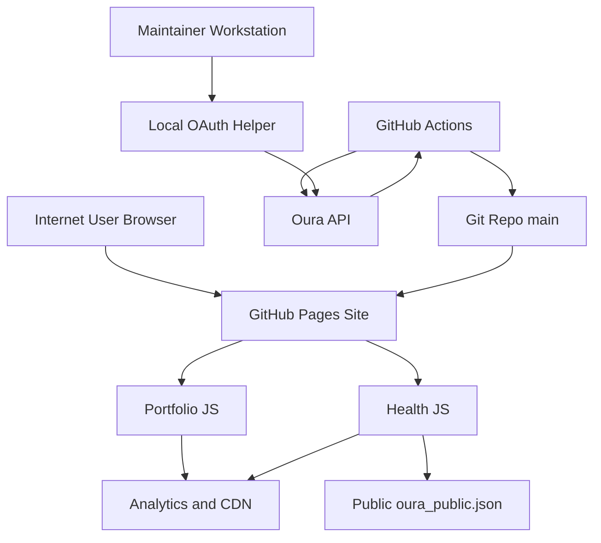

## Executive summary

This repository is a static public website with a public health dashboard, so its highest-risk themes are not classic server-side injection bugs. The main risks are (1) compromise of the maintainer/CI path that holds Oura credentials and can write directly back to the repo, (2) privacy profiling from the intentionally public `oura_public.json` dataset, and (3) integrity or script-supply-chain issues in the browser because runtime pages trust third-party resources and rendered JSON. Evidence anchors: `index.html`, `health/index.html`, `js/health.js`, `.github/workflows/oura-update.yml`, `scripts/fetch_oura_and_write_json.mjs`.

## Scope and assumptions

- In scope:
  - Public runtime site: `index.html`, `health/index.html`, `css/styles.css`, `js/main.js`, `js/animations.js`, `js/analytics.js`, `js/health.js`, `oura_public.json`
  - Publish/deploy path: `.github/workflows/pages.yml`, `.github/workflows/oura-update.yml`, `.github/workflows/ci.yml`
  - Oura credential handling and data-publication tooling: `scripts/fetch_oura_and_write_json.mjs`, `scripts/get-oura-token.mjs`, `scripts/refresh-oura-token.mjs`, `docs/SETUP.md`, `docs/DEPLOYMENT.md`
- Out of scope:
  - Cloudflare dashboard configuration that is described in docs but not enforced from this repo
  - GitHub branch protection, environment protection, secret-scoping, or org policies that cannot be verified from the repo
  - Third-party service internals for Oura, Google Analytics, Google Fonts, Cloudflare CDN, and GitHub Pages
- Explicit assumptions:
  - Production hosting is GitHub Pages on `main`, with Cloudflare in front, as described in `README.md` and `docs/DEPLOYMENT.md`.
  - There is no authenticated admin panel, user account system, or server-side API in production runtime; the site serves static files only.
  - The whole repo is the right scope because the public site’s behavior depends on CI workflows and Oura helper scripts that generate `oura_public.json`.
  - The Oura-derived data is intentionally public and low sensitivity, but it still reveals behavioral patterns.
  - The scheduled Oura workflow is part of production behavior because `.github/workflows/oura-update.yml` runs on a cron schedule and pushes changes back to the repo.
- Open questions that would materially change ranking:
  - Whether GitHub branch protection or required reviews prevent the scheduled workflow from writing to `main`
  - Whether the Oura OAuth app is single-user/personal-only or shared across additional environments

## System model

### Primary components

- Static portfolio page served from GitHub Pages: `index.html`, `css/styles.css`, `js/main.js`, `js/animations.js`, `js/analytics.js`
- Static health dashboard page served from GitHub Pages: `health/index.html`, `js/health.js`
- Public health data artifact: `oura_public.json`, fetched client-side by `js/health.js`
- CI data publisher: `.github/workflows/oura-update.yml` runs `scripts/fetch_oura_and_write_json.mjs`, stages `oura_public.json`, commits, and pushes
- CI deploy pipeline: `.github/workflows/pages.yml` assembles `_site/` and deploys to GitHub Pages when `main` changes or when the Oura workflow completes successfully
- Local maintainer OAuth bootstrap: `scripts/get-oura-token.mjs` starts a localhost callback server on port `3000`, opens a browser, exchanges OAuth code, and writes `.oura_token`
- External services: Oura OAuth/API, GitHub Actions/Pages, Google Analytics, Google Fonts, cdnjs-hosted assets

### Data flows and trust boundaries

- Internet user -> GitHub Pages static site
  - Data: HTML, CSS, JS, images, PDF, `oura_public.json`
  - Channel: HTTPS
  - Security guarantees: static hosting, browser same-origin policy, CSP meta tags in `index.html` and `health/index.html`
  - Validation/enforcement: no server-side validation because there is no server-side runtime in repo
- Browser -> `oura_public.json`
  - Data: public health metrics including daily scores, contributor values, step/calorie totals, workout counts, temperature deviation, and downsampled timestamped heart-rate series
  - Channel: same-origin fetch in `js/health.js`
  - Security guarantees: same-origin fetch, no credentials included, CSP `connect-src 'self'` on `/health`
  - Validation/enforcement: only a loose `typeof data === 'object'` check client-side; no schema enforcement in `js/health.js`
- Browser -> third-party analytics and asset CDNs
  - Data: page views, click events, browser requests for JS/CSS/fonts
  - Channel: HTTPS to `www.googletagmanager.com`, Google Analytics endpoints, Google Fonts, cdnjs
  - Security guarantees: CSP allowlists in `index.html` and `health/index.html`; some resources use SRI (`font-awesome`), others do not (`gtag`, Google Fonts, GSAP scripts in `index.html`)
  - Validation/enforcement: browser origin rules only; no runtime integrity verification for all third-party assets
- GitHub Actions -> Oura API
  - Data: OAuth refresh/access tokens and health API responses
  - Channel: outbound HTTPS from `scripts/fetch_oura_and_write_json.mjs`
  - Security guarantees: bearer-token auth to Oura, GitHub Secrets for credential injection per `docs/SETUP.md` and `.github/workflows/oura-update.yml`
  - Validation/enforcement: script normalizes fields and intentionally omits exact sleep start/end timestamps, but it does not cryptographically attest data provenance
- GitHub Actions -> Git repository / GitHub Pages
  - Data: generated `oura_public.json`, commits to repo, Pages deployment artifact
  - Channel: GitHub Actions checkout/push and deploy actions
  - Security guarantees: workflow permissions are `contents: write` in `.github/workflows/oura-update.yml`; Pages deploy uses GitHub-managed actions in `.github/workflows/pages.yml`
  - Validation/enforcement: changed-file check before commit; no separate approval step in repo for scheduled data commits
- Maintainer machine -> localhost OAuth callback helper
  - Data: OAuth authorization code and refresh token
  - Channel: local HTTP callback on `http://localhost:3000/callback` started by `scripts/get-oura-token.mjs`
  - Security guarantees: random `state` token check in `scripts/get-oura-token.mjs`
  - Validation/enforcement: local-only listener on `127.0.0.1`; token written to `.oura_token` without additional OS-level hardening

#### Diagram

## Assets and security objectives

| Asset | Why it matters | Security objective (C/I/A) |
| --- | --- | --- |
| Oura OAuth refresh/access tokens | Theft would allow continued access to the owner’s health data and token rotation path | C, I |
| `oura_public.json` published dataset | Tampering changes public claims; overexposure enables behavioral profiling | C, I |
| GitHub repository `main` branch | Controls the public website and scheduled data publication path | I, A |
| GitHub Actions workflow authority | Scheduled job can write commits and update secrets, so compromise expands blast radius | C, I, A |
| Public website pages and JS | Tampering can mislead visitors, inject hostile client logic, or break availability | I, A |
| Deploy artifact `_site/` / GitHub Pages output | Integrity failure ships incorrect or malicious public content | I, A |
| Analytics event stream | Lower sensitivity, but can leak browsing behavior or create false telemetry if poisoned | C, I |
| Local `.oura_token` file on maintainer machine | Local secret persistence used to bootstrap or refresh Oura access | C |

## Attacker model

### Capabilities

- Remote unauthenticated internet user can fetch any public page and `oura_public.json`.
- Remote attacker can inspect client code, replay public requests, and profile the published health data over time.
- Remote attacker can attempt to exploit third-party script trust or any compromised maintainer/browser environment involved in OAuth bootstrap.
- Malicious contributor with repo write access, compromised GitHub token, or compromised GitHub Action context can alter workflows, generated JSON, or deployed site contents.
- Attacker controlling or intercepting a third-party dependency source could influence runtime behavior if an allowed external script/resource is compromised.

### Non-capabilities

- No direct server-side request handling, database query surface, file upload surface, or authenticated API exists in the repo’s production runtime.
- There is no evidence of multi-tenant authorization logic, customer data isolation, or privileged end-user roles in the deployed site.
- A remote unauthenticated attacker cannot directly invoke Oura APIs through the public site because Oura tokens are not shipped to the browser and `js/health.js` fetches only same-origin JSON.

## Entry points and attack surfaces

| Surface | How reached | Trust boundary | Notes | Evidence (repo path / symbol) |
| --- | --- | --- | --- | --- |
| Portfolio homepage | Public HTTPS request to `/` | Internet -> GitHub Pages | Loads local JS plus external fonts/CDN/analytics | `index.html` |
| Health dashboard page | Public HTTPS request to `/health/` | Internet -> GitHub Pages | Fetches public health JSON and renders dynamic UI | `health/index.html`, `js/health.js:loadHealthData` |
| Public health JSON | Public HTTPS request to `/oura_public.json` | Internet -> GitHub Pages | Intentionally public health metrics artifact | `oura_public.json`, `.github/workflows/pages.yml` |
| Analytics event emission | User page interaction in browser | Browser -> third-party endpoints | Page views and click events sent to GA if configured | `js/analytics.js:bootstrapGa4`, `js/analytics.js:emit` |
| Oura scheduled update job | GitHub cron / manual dispatch | GitHub Actions -> Oura API / GitHub repo | Uses secrets, writes repo contents, may rotate refresh token secret | `.github/workflows/oura-update.yml`, `scripts/fetch_oura_and_write_json.mjs:main` |
| Local OAuth callback helper | Maintainer runs CLI script | Maintainer machine -> localhost -> Oura | Exchanges code for refresh token, writes `.oura_token` | `scripts/get-oura-token.mjs:main` |
| Pages deploy job | Push to `main` or successful Oura workflow | GitHub Actions -> GitHub Pages | Publishes `_site/`, excludes scripts/docs but ships runtime files | `.github/workflows/pages.yml` |

## Top abuse paths

1. Attacker obtains GitHub Actions or maintainer repo-write capability -> modifies `scripts/fetch_oura_and_write_json.mjs` or `.github/workflows/oura-update.yml` -> scheduled job runs with Oura secrets and `contents: write` -> attacker persists malicious site changes or steals refreshed tokens.
2. Attacker repeatedly collects `oura_public.json` snapshots -> correlates daily scores, workout counts, temperature deviation, and timestamped heart-rate series -> infers sleep/wake patterns, activity windows, and likely presence/absence patterns -> privacy harm or targeted social engineering.
3. Allowed third-party script/resource source is compromised -> browser loads malicious JS/CSS within existing CSP allowances -> attacker gains client-side execution or UI manipulation on the public site -> visitor trust and site integrity are compromised.
4. Malicious maintainer or compromised Oura account returns manipulated health data -> CI publishes false `oura_public.json` -> public dashboard displays incorrect physiological claims that appear authoritative because they are served from the primary domain.
5. Malformed or unexpectedly large Oura API response passes through weak normalization -> generated JSON or client rendering degrades -> `/health` becomes misleading or unavailable until the next successful update.
6. Local machine malware or another local process races the OAuth bootstrap flow on port `3000` -> captures authorization code or tampers with `.oura_token` -> attacker gains Oura refresh capability outside the repo.

## Threat model table

| Threat ID | Threat source | Prerequisites | Threat action | Impact | Impacted assets | Existing controls (evidence) | Gaps | Recommended mitigations | Detection ideas | Likelihood | Impact severity | Priority |
| --- | --- | --- | --- | --- | --- | --- | --- | --- | --- | --- | --- | --- |
| TM-001 | Compromised GitHub Action context, repo writer, or stolen maintainer token | Attacker needs write influence over the repo/workflows or the ability to execute within the scheduled workflow context. The workflow already has `contents: write` and consumes Oura secrets. | Modify scheduled workflow or data-generation script to exfiltrate secrets, push malicious content, or persist unauthorized commits on `main`. | Full integrity compromise of the website and possible theft of Oura credentials. | Oura tokens, `main`, deployed site, workflow authority | Scheduled workflow is serialized with `concurrency`; secrets are injected at runtime; Pages build excludes `scripts/` from deploy output. Evidence: `.github/workflows/oura-update.yml`, `.github/workflows/pages.yml`. | No repo-visible approval gate or environment protection for cron-driven writes; workflow both reads secrets and writes to repo; optional secret rotation uses `gh secret set`. | Move Oura publishing to a non-`main` branch or separate repo/artifact bucket; require protected-branch exceptions to be narrowly scoped; split secret-using job from commit-writing job; use GitHub environments with required reviewers for secret rotation; alert on workflow file changes. | Alert on workflow file diffs, cron job failures/success spikes, commits authored by `github-actions[bot]`, and secret-rotation events. | Medium | High | high |
| TM-002 | Passive remote observer or targeted stalker | Attacker only needs access to the public site over time. Data is intentionally public and unauthenticated. | Collect and correlate `oura_public.json` snapshots to infer routine, sleep timing, exercise cadence, and physiological deviations. | Privacy harm, targeted social engineering, or presence inference. | Published health metrics, owner privacy | Script intentionally omits exact sleep start/end timestamps and rounds many values. Evidence: `docs/SETUP.md`, `scripts/fetch_oura_and_write_json.mjs`. | Timestamped heart-rate series, daily history, workout counts, and temperature deviation still expose behavior patterns; public JSON is easy to archive. | Reduce retention or granularity further; quantize timestamps to coarse buckets; consider omitting temperature deviation and intraday heart-rate series; publish only latest daily summary if profiling risk outweighs value. | Periodically diff public JSON schema/content and review whether new fields increase inference risk; monitor traffic spikes to `oura_public.json`. | High | Medium | high |
| TM-003 | Third-party CDN or analytics supply-chain attacker | Attacker needs compromise of an allowed third-party asset source or browser-side injection path. | Deliver malicious JS/CSS through allowed external script/font/CDN origins, causing client-side execution or deceptive content. | Visitor-facing integrity compromise and possible analytics or link hijacking. | Public pages, visitor trust, analytics telemetry | CSP restricts origins; some assets use SRI (`font-awesome`); scripts are loaded over HTTPS. Evidence: `index.html`, `health/index.html`. | Not all external resources are pinned with SRI; `gtag` and Google Fonts are trusted by origin only; homepage allows cdnjs-hosted GSAP scripts. | Self-host JS/CSS dependencies where practical; add SRI where supported; minimize allowed external origins; consider nonce/hash-based CSP for all scripts. | Monitor CSP violation reports if enabled at Cloudflare; periodically inventory remote dependencies and review changes. | Medium | Medium | medium |
| TM-004 | Compromised Oura account/app or malicious maintainer | Attacker needs Oura credential control or code write access. | Feed false but plausible health data into the generation script so the site publishes inaccurate or manipulated metrics. | Public misinformation and loss of integrity for the health dashboard. | `oura_public.json`, public trust | The script normalizes fields, chooses a bounded subset, and logs summaries without printing secrets. Evidence: `scripts/fetch_oura_and_write_json.mjs`. | No signature or provenance check on generated JSON; no sanity bounds for all published fields beyond some heart-rate normalization. | Add schema validation with explicit numeric bounds before write; record signed provenance metadata (generator version, commit SHA); reject anomalous deltas beyond policy thresholds. | Alert on unusual metric jumps, schema changes, or sudden field-count increases in `oura_public.json`. | Medium | Medium | medium |
| TM-005 | Oura API change, malformed data, or accidental maintainer bug | Oura returns unexpected shapes or a code change weakens normalization. Client trusts generated JSON beyond a shallow object check. | Publish malformed JSON or unexpected field shapes that cause `/health` rendering failures or misleading display. | Partial availability loss or silent misrepresentation on `/health`. | Health dashboard availability and integrity | The generator normalizes many fields and preserves prior snapshot on some local failures; client catches fetch/render errors and shows an error state. Evidence: `scripts/fetch_oura_and_write_json.mjs`, `js/health.js:loadHealthData`. | No end-to-end schema validation contract; no CI test that validates generated JSON against the page’s expectations. | Define a JSON schema and validate both in generator CI and client tests; add a smoke test that loads `/health` against sample data. | Alert on repeated workflow failures, `health` page fetch errors, or sudden growth/shrinkage of `oura_public.json`. | Medium | Low | medium |
| TM-006 | Local malware or hostile local process on maintainer workstation | Attacker must already have local foothold on the maintainer machine or control a conflicting local process. | Intercept localhost OAuth callback or read `.oura_token` after it is written. | Theft of Oura refresh token and continued access to upstream health data. | Local `.oura_token`, Oura account access | OAuth helper uses random `state` and binds to `127.0.0.1`. Evidence: `scripts/get-oura-token.mjs`. | Token is written in plaintext to `.oura_token`; no file-permission hardening or secure storage. | Store refresh token in OS keychain instead of plaintext file; set restrictive file permissions; document local secret handling hygiene. | Log token refresh failures/rotations and review for unexpected churn; watch local file-access monitoring if available. | Low | Medium | low |

## Criticality calibration

For this repo, priority is driven by whether an issue can change public site integrity, steal Oura credentials, or materially increase privacy exposure.

- `critical`
  - Scheduled workflow compromise that both steals Oura secrets and gains persistent write access to production content
  - A browser-side dependency compromise that gives reliable script execution on the primary domain at scale
  - Any change that turns intentionally low-sensitivity health publication into direct disclosure of exact sleep timestamps or full raw physiological history
- `high`
  - Public data exposures that enable consistent routine inference from `oura_public.json`
  - Unauthorized modification of `main` or generated JSON through CI/workflow misuse
  - Oura token theft that grants ongoing upstream data access
- `medium`
  - Single-page integrity or availability regressions on `/health`
  - False telemetry or misleading public metrics caused by malformed generated data
  - Third-party dependency trust issues with constrained exploitability
- `low`
  - Minor static-site defacement requiring prior repo write access and no secret exposure
  - Local-only OAuth helper issues that already assume local compromise
  - Noisy availability issues mitigated by rerunning the scheduled job or serving the static homepage unaffected

## Focus paths for security review

| Path | Why it matters | Related Threat IDs |
| --- | --- | --- |
| `.github/workflows/oura-update.yml` | Holds the highest-value trust transition: scheduled secret use plus automated repo writes and optional secret rotation | TM-001, TM-004 |
| `scripts/fetch_oura_and_write_json.mjs` | Defines which upstream Oura data becomes public and how failures, rotation, and normalization are handled | TM-001, TM-002, TM-004, TM-005 |
| `scripts/get-oura-token.mjs` | Local OAuth bootstrap handles authorization code flow and persists refresh tokens | TM-006 |
| `js/health.js` | Browser trust boundary for untyped JSON rendering and client-side error handling | TM-002, TM-005 |
| `health/index.html` | CSP boundary and the public page that exposes the health dataset | TM-002, TM-003 |
| `index.html` | Loads third-party runtime assets and defines the homepage CSP and external dependencies | TM-003 |
| `js/analytics.js` | Emits cross-origin analytics events and dynamically bootstraps GA in the browser | TM-003 |
| `.github/workflows/pages.yml` | Defines what is shipped to production and which repo files are excluded from deploy artifact assembly | TM-001 |
| `docs/SETUP.md` | Documents intended public-data sanitization and secrets handling assumptions | TM-002, TM-006 |
| `docs/DEPLOYMENT.md` | Documents security headers and Cloudflare controls that may or may not actually be enforced outside the repo | TM-003 |

## Quality check

- Covered discovered entry points: homepage, health page, public JSON, analytics calls, scheduled Oura job, local OAuth helper, and Pages deploy path.
- Represented each main trust boundary in threats: browser/runtime, browser-to-third-party, Actions-to-Oura, Actions-to-repo, maintainer-to-local OAuth helper.
- Separated runtime behavior from CI/dev tooling: static site risks are distinct from Oura scripts and GitHub workflows.
- Reflected user clarifications: low-sensitivity public data; production workflow writeback assessed from repo evidence rather than assumed.
- Assumptions and open questions are explicit, especially around branch protection and external platform controls not visible from the repo.
